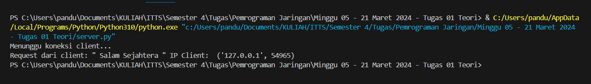
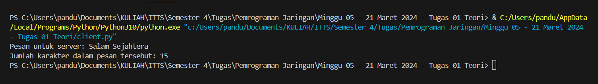

# Tugas 01 - Socket Programming on Python

Rincian Tugas:
<li style="text-align:justify;">
Membuat sebuah program server yang dapat menerima koneksi dari klien menggunakan protokol TCP. Server ini akan menerima pesan dari klien dan mengirimkan pesan balasan berisi jumlah karakter pada pesan tersebut. Gunakan port 12345 untuk server. Membuat analisa dari hasil program tersebut </li>
<br>
<li style="text-align:justify;">
Membuat sebuah program klien yang dapat terhubung ke server yang telah dibuat pada soal nomor 1. Klien ini akan mengirimkan pesan ke server berupa inputan dari pengguna dan menampilkan pesan balasan jumlah karakter yang diterima dari server. Membuat analisa dari hasil program tersebut </li>
<br>

## Server TCP

<p style="text-align:justify;">
Pertama, diimpor module socket yang menyediakan cara bekerja dengan socket. Lalu, Socket bertipe TCP (SOCK_STREAM) dibuat dan diikat dengan alamat localhost dan port 12345.
</p>

```python
import socket

server_socket = socket.socket(socket.AF_INET, socket.SOCK_STREAM)

HOST = 'localhost'
PORT = 12345

server_socket.bind((HOST, PORT))
```

<p style="text-align:justify;">
Socket yang telah dibuat menjalankan metode listen dengan backlog sejumlah 1, yang artiya saat ini socket menjadi pendengar pasif dengan 1 jumlah koneksi yang dapat diantri. Selanjutnya, socket menjalankan metode accept untuk membuka port yang telah terikat sehingga socket dapat mulai menerima koneksi dari client sekaligus informasinya disimpan didalam variable client_socket dan client_address.
</p>

```python
server_socket.listen(1)
print("Menunggu koneksi client...")
client_socket, client_address = server_socket.accept()
```

<p style="text-align:justify;">
Jika client sudah terkoneksi dengan server, maka informasi client sudah tersimpan dalam variable client_socket. Dari informasi tersebut, dijalankan metode recv(1024) untuk mengambil data yang dikirimkan oleh client melalui socket dengan ukuran buffer 1024 byte. Pesan dari client kemudian disimpan dalam variable data, yang nantinya akan diterjemahkan dengan fungsi decode() dan disimpan dalam variable angka. Setelah itu, pesan dan informasi alamat client ditampilkan.
</p>

```python
data = client_socket.recv(1024)
pesan = data.decode()

print("Request dari client: \"", pesan, "\" IP Client: ", client_address)
```

<p style="text-align:justify;">
Pesan yang diterima berupa baris karakter (string) yang dihitung menggunakan fungsi len() yang merupakan fungsi bawaan python yang berguna untuk menghitung jumlah karakter yang dimuat dalam sebuah string.
</p>

```python
response = "Jumlah karakter dalam pesan tersebut: " + str(len(pesan))
```

<p style="text-align:justify;">
Respon yang telah disiapkan, disandikan dengan metode encode() kemudian dikirim ke client. Setelah itu, socket client ditutup dan dilanjut penutupan socket server untuk mengakhiri koneksi.
</p>

```python
client_socket.sendall(response.encode())

client_socket.close()
server_socket.close()
```
<br>

## Client TCP

<p style="text-align:justify;">
Untuk Client Socket, diimpor module socket yang menyediakan cara bekerja dengan socket. Socket bertipe TCP (SOCK_STREAM) dibuat dan dikoneksikan dengan socket yang terikat dengan alamat localhost dan port 12345 (Server Socket).
</p>

```python
import socket

client_socket = socket.socket(socket.AF_INET, socket.SOCK_STREAM)

HOST = 'localhost'
PORT = 12345

client_socket.connect((HOST, PORT))
```
<p style="text-align:justify;">
Input yang diterima (String) disimpan dalam variable pesan. Kemudian, pesan disandikan lalu dikirim ke socket yang telah terkoneksi (Server Socket).
</p>

```python
pesan = input("Pesan untuk server: ")
client_socket.sendall(pesan.encode())
```
<p style="text-align:justify;">
Menggunakan metode recv(1024), client mengambil pesan yang dikirim (respon) dari server dengan ukuran buffer sebesar 1024 byte. Kemudian pesan diterjemahkan dan ditampilkan.
</p>

```python
data = client_socket.recv(1024)
print(data.decode())
```
<p style="text-align:justify;">
Akhirnya koneksi ditutup/diakhiri dengan menjalankan metode close() dari client socket.
</p>

```python
client_socket.close()
```
<br>

## Output

server.py


<p style="text-align:justify;">
Berdasarkan output di atas, diketahui bahwa server mampu menerima koneksi dan request dari client. Selain itu, server juga mengolah data (pesan) yang diterima dengan menghitung jumlah karakternya dan mengirimkannya ke client sebagai bentuk respon.
</p>
<br>

client.py


<p style="text-align:justify;">
Berdasarkan output di atas, diketahui bahwa client mampu terhubung dengan server dan mengirimkan data (pesan bertipe String) dari input user, lalu menerima dan menampilkan respon server terhadap data yang dikirimkan, yaitu jumlah karakter dari pesan.
</p>
