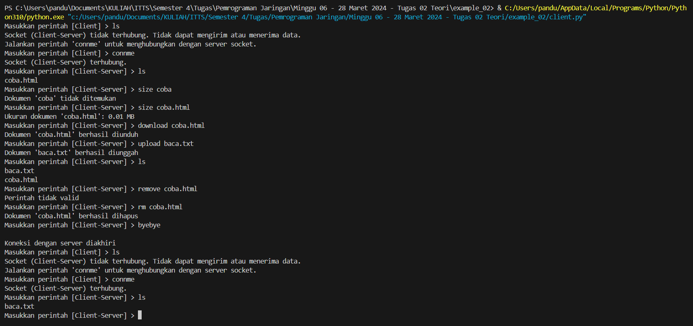

# Tugas 02 - FTP Socket Programming on Python

<p style="text-align:justify;">
Simulasi FTP (File Transfer Protocol) menggunakan koneksi socket (TCP) antara Client dan Server secara lokal. Dimana Client yang terhubung dengan Server, mengirimkan perintah untuk berinteraksi dengan dokumen-dokumen yang tersimpan di direktori server.</p>
<p style="text-align:justify;">
TCP (Transmission Control Protocol) dipilih karena FTP dirancang untuk bekerja di atas TCP, sehingga menggunakan TCP untuk simulasi FTP secara lokal akan memberikan hasil yang paling mendekati operasi FTP sebenarnya di lingkungan produksi. Karena pada dasarnya, TCP menyediakan layanan yang andal dengan memastikan bahwa data yang dikirim akan sampai ke tujuan tanpa kesalahan dan dalam urutan yang benar. Ini penting untuk transfer file agar file yang diterima tidak rusak.</p>
<br>

## Menyiapkan Program Server

<p style="text-align:justify;">
Pertama, diimpor modul socket dan modul os.
</p>

```python
# Modul socket, menyediakan fungsi dan metode untuk membuat koneksi jaringan
import socket
# Modul os, menyediakan fungsi dan metode untuk berinteraksi dengan sistem operasi
import os
```

<p style="text-align:justify;">
Menyiapkan konstanta untuk menyimpan data-data yang akan sering diguanakan dan tidak perlu perubahan ketika run-time.
</p>

```python
# ALamat IP dan Port Server
SERVER_HOST = 'localhost'
SERVER_PORT = 12345
# Ukuran buffer untuk menerima pesan/data (1 Mb)
BUFFER_SIZE = 1048600  
# Direktori dokumen server
FILE_DIR = 'server_files'
```

<p style="text-align:justify;">
Menggunakan metode bawaan modul os untuk memastikan keberadaan direktori server. Jika belum ada, maka direktori dibuat. Direktori ini diperlukan untuk menyendirikan penyimpanan dokumen-dokumen milik server.
</p>

```python
# Memastikan keberadaan direktori server_files
if not os.path.exists(FILE_DIR):
    os.makedirs(FILE_DIR)
```

<p style="text-align:justify;">
Server socket dibuat dan diikat dengan alamat IP dan port yang telah disipkan. Kemudian, server socket menjalankan metode <em>listen(5)</em> untuk siap menerima koneksi dengan antrian sebanyak 5.
</p>

```python
# Menyiapkan server socket
server_socket = socket.socket(socket.AF_INET, socket.SOCK_STREAM)
server_socket.bind((SERVER_HOST, SERVER_PORT))
server_socket.listen(5)
print(f"Server siap menerima koneksi di {SERVER_HOST}:{SERVER_PORT}")
```

<p style="text-align:justify;">
Di dalam infinite loop, server socket menerima koneksi client yang masuk dan menyimpan informasi client tersebut. Server yang sudah terhubung dengan client, siap meladeni perintah yang dikirimkan client melalui fungsi <em>handle_client({client socket})</em>.
</p>

```python
# Menerima clients
while True:
    client_conn, client_addr = server_socket.accept()
    print(f"Menerima koneksi dari {client_addr}")
    handle_client(client_conn)
```

<p style="text-align:justify;">
Selanjutnya adalah menyipakan fungsi bernama <em>handle_client</em> untuk mengurus perintah yang diterima dari client. Di dalamnya, terdapat perulangan while yang akan terus berjalan sampai nantinya ada kondisi yang menghentikannya.
</p>

```python
def handle_client(client_socket):
    while True:
      .
      .
      .
```

<p style="text-align:justify;">
Dalam perulangan while di atas, client socket disiapkan untuk membaca pesan yang diterima. Beberapa pesan dapat dibagi menjadi dua bagian, yaitu perintah dan parameter berupa nama dokumen. Parameter dapat diperoleh dengan mengakses <em>split_command</em> di indeks ke-1.
</p>

```python
while True:
  # Menerima perintah client
  command = client_socket.recv(BUFFER_SIZE).decode()
  # Menyimpan perintah yang sudah dipecah
  split_command = command.split()
  # Menyimpan perintah Client
  action = split_command[0].lower()
  print(f"Menerima perintah: {action}")
```

<p style="text-align:justify;">
Masih di dalam perulangan while, disiapkan pengondisian untuk beberapa perintah (custom) FTP. Berikut daftar perintah beserta keterangannya:
</p>

| Perintah | Keterangan |
|----|----|
| ls | Ketika client menginputkan command tersebut, maka server akan memberikan daftar file dan folder. |
| rm {nama file} | Ketika client menginputkan command tersebut, maka server akan menghapus file dengan acuan nama file yang diberikan pada parameter pertama. |
| download {nama file} {direktori tujuan\nama file baru} | Ketika client menginputkan command tersebut, maka server akan memberikan file dengan acuan nama file yang diberikan pada parameter pertama. |
| upload {nama file} {direktori tujuan\nama file baru} | Ketika client menginputkan command tersebut, maka server akan menerima dan menyimpan file dengan acuan nama file yang diberikan pada parameter pertama. |
| size {nama file} | Ketika client menginputkan command tersebut, maka server akan memberikan informasi file dalam satuan MB (Mega bytes) dengan acuan nama file yang diberikan pada parameter pertama. |
| byebye | Ketika client menginputkan command tersebut, maka hubungan socket client akan diputus. |
| connme | Ketika client menginputkan command tersebut, maka hubungan socket client akan terhubung. |

```python
# Mengurus perintah ls atau list
if action == 'ls':
    .
    .

# Mengurus perintah rm atau remove dan parameternya (nama dokumen)
elif action == 'rm' and len(split_command) > 1:
    .
    .

# Mengurus perintah upload dan parameternya (nama dokumen)
elif action == 'upload' and len(split_command) > 1:
    .
    .

# Mengurus perintah download dan parameternya (nama dokumen)
elif action == 'download' and len(split_command) > 1:
    .
    .

# Mengurus perintah size dana parameternya (nama dokumen)
elif action == 'size' and len(split_command) > 1:
    .
    .

# Mengurus perintah byebye
elif action == 'byebye':
    .
    .

# Mengurus perintahh connme
elif action == 'connme':
    .
    .

# Mengurus perintah yang tidak disediakan
else:
    # Mengirim pemberitahuan ke client
    client_socket.send('Perintah tidak valid'.encode())
```

<p style="text-align:justify;">
Terdapat 7 perintah yang disediakan. Pertama adalah perintah ls atau list. Perintah ini berguna untuk memberi tahu client isi direktori server. Berikut adalah blok kode untuk perintah (kondisi) tersebut:
</p>

```python
# Mengurus perintah ls atau list
if action == 'ls':
    # Untuk menyimpan nama direktori dan path dokumen
    files = ""
    filepath = ""
    if len(split_command) == 1:
        # Mendapatkan daftar dokumen dalam direktori
        files = os.listdir(FILE_DIR)
    else:
        try:
            # Mendapatkan file path
            filepath = os.path.join(FILE_DIR, split_command[1])
            if os.path.isdir(filepath):
                # Mendapatkan daftar dokumen dalam direktori
                files = os.listdir(filepath)
            else:
                client_socket.send(f"Direktori '{filepath}' tidak ditemukan.".encode())
                continue
        except:
            client_socket.send(f"Direktori '{filepath}' tidak ditemukan.".encode())
            continue
    
    # Jika direktori tidak kosong
    if len(files) > 0:
        # Menformat daftar dokumen menjadi daftar yang dipisahkan baris baru (String)
        files_list = '\n'.join(files)
        # Mengirimkan daftar dokumen yang sudah disiapkan
        client_socket.sendall(files_list.encode())
    else:
        client_socket.send(f"Direktori '{FILE_DIR}' kosong.".encode())
```

> **CATATAN:** F-string, di mana f sebelum tanda kutip menunjukkan bahwa ini adalah formatted string literal. Fitur yang membuat penulisan dan pembacaan kode yang memerlukan interpolasi string menjadi lebih mudah dan lebih intuitif. {FILE_DIR} adalah placeholder di mana nilai dari variabel FILE_DIR akan dimasukkan ke dalam string.

<p style="text-align:justify;">
Perintah kedua adalah perintah rm atau remove. Perintah ini berguna untuk menghapus dokumen terpilih (sesuai parameter) dalam direktori server. Berikut adalah blok kode untuk perintah (kondisi) tersebut:
</p>

```python
# Mengurus perintah rm atau remove dan parameternya (nama dokumen)
elif action == 'rm' and len(split_command) > 1:
    # Menyimpan nama dokumen
    file_name = split_command[1]
    # Menyiapkan path dokumen
    filepath = os.path.join(FILE_DIR, file_name)
    try:
        # Coba hapus dokumen sesuai path, lalu beritahu client
        os.remove(filepath)
        client_socket.send(f"Dokumen '{file_name}' berhasil dihapus".encode())
    except FileNotFoundError:
        # Jika dokumen tidak ditemukan sesuai path, maka peringatkan client
        client_socket.send(f"Dokumen '{file_name}' tidak ditemukan".encode())
```

<p style="text-align:justify;">
Perintah ketiga adalah perintah upload. Perintah ini berguna untuk mengunggah dokumen yang ada di direktori client ke dalam direktori server. Dalam proses penggunggan, client dapat memilih folder/direktori tujuan unggahan serta mengganti nama dokumen unggahan sebagai cara untuk menghindari kesamaan nama. Berikut adalah blok kode untuk perintah (kondisi) tersebut:
</p>

```python
# Mengurus perintah upload dan parameternya (nama dokumen)
elif action == 'upload' and len(split_command) > 1:
    # Menerima data dari client
    file_data = client_socket.recv(BUFFER_SIZE)
    # Untuk menyimpan nama dokumen dan path dokumen
    file_name = ""
    filepath = ""
    # Jika data yang diterima bukan '-1' atau dokumen tersedia dan siap diupload
    if file_data.decode() != '-1':
        # Jika ada argumen kedua
        if len(split_command) > 2:
            # Menyimpan argumen kedua
            second_arg = split_command[2]
            # Mendapatkan format dokumen
            origin_format = split_command[1].split('.')[-1]
            new_format = split_command[2].split('.')[-1]
            # Jika argumen kedua tidak mengandung slash dan backslah dan mengandung titik, langsung ambil sebagai nama dokumen
            if second_arg.find('\\') == -1 and second_arg.find('/') == -1 and second_arg.find('.') != -1:
                # Menyimpan nama dokumen
                file_name = second_arg
                # Menyiapkan path dokumen
                if origin_format == new_format:
                    filepath = os.path.join(FILE_DIR, file_name)
                else:
                    client_socket.send(f"Argumen tidak valid. Tidak dapat menggunggah dokumen manjadi format lain.".encode())   
                    continue
            # Jika argumen kedua mengandung slash atau tidak mengandung titik
            elif second_arg.find('/') > -1 or second_arg.find('.') == -1:
                client_socket.send(f"Argumen tidak valid. Perhatikan penulisan path!".encode())
                continue
            else:
                # Mendapatkan nama file    
                split_second_arg = second_arg.split("\\")
                file_name = split_second_arg[len(split_second_arg)-1]   
                # Menyiapkan path dokumen
                filepath = os.path.join(FILE_DIR, second_arg)
        else:       
            file_name = split_command[1]
            # Menyiapkan path dokumen
            filepath = os.path.join(FILE_DIR, file_name)
            

        # Jika client mengunggah dokumen untuk disimpan di direktori tertentu
        if len(split_command) > 1:
            # Jika file ditemukan dalam direktori
            if os.path.isfile(filepath):
                client_socket.send(f"Dokumen dengan nama ({file_name}) sudah ada di direktori server.".encode())  
            else:
                try:
                    # Membuat/menulis dokumen sesuai path
                    with open(filepath, 'wb') as f:
                        # Menerima data file yang "diupload" client, lalu menuliskannya ke dokumen yang dibuat
                        f.write(file_data)
                    # Memberi feedback client
                    size = os.path.getsize(filepath) / (1024 * 1024)
                    client_socket.send(f"Dokumen '{file_name}' ({size:.2f} MB) berhasil diunggah di direktori '{filepath}' server.".encode())                
                except:
                    # Jika file tidak dapat dibuat karena direktori tidak ada atau kesalahan lain
                    client_socket.send(f"Argumen tidak valid. Gagal mengunggah dokumen.".encode())   
                    continue             
```

<p style="text-align:justify;">
Perintah keempat adalah perintah download. Perintah ini berguna untuk mengunduh dokumen yang ada di direktori server ke dalam direktori client. Dalam proses pengunduhan, client dapat memilih folder/direktori tujuan unduhan serta mengganti nama dokumen unduhan sebagai cara untuk menghindari kesamaan nama. Berikut adalah blok kode untuk perintah (kondisi) tersebut:
</p>

```python
# Mengurus perintah download dan parameternya (nama dokumen)
elif action == 'download' and len(split_command) > 1:
    # Menyimpan nama dokumen
    file_name = split_command[1]
    # Menyiapkan path dokumen
    filepath = os.path.join(FILE_DIR, file_name)
    # Jika path merujuk pada sebuah dokumen, 
    if os.path.isfile(filepath):
        # maka baca data dokumen tersebut dan kirim datanya ke client
        with open(filepath, 'rb') as f:
            client_socket.sendall(f.read())
    else:
        # Awali dengan mengirim kode peringatan bahwa dokumen tidak ditemukan
        client_socket.send('-1'.encode()) 
```

<p style="text-align:justify;">
Perintah kelima adalah perintah size. Perintah ini berguna untuk mendapatkan ukuran dokumen yang ada di direktori server. Berikut adalah blok kode untuk perintah (kondisi) tersebut:
</p>

```python
# Mengurus perintah size dana parameternya (nama dokumen)
elif action == 'size' and len(split_command) > 1:
    # Menyimpan nama dokumen
    file_name = split_command[1]
    # Menyiapkan path dokumen
    filepath = os.path.join(FILE_DIR, file_name)
    # Jika path merujuk pada sebuah dokumen, maka hitung ukuran file dalam satuan MegaByte
    if os.path.isfile(filepath):
        size = os.path.getsize(filepath) / (1024 * 1024)
        client_socket.send(f"Ukuran dokumen '{file_name}': {size:.2f} MB".encode())
    else:
        client_socket.send(f"Dokumen '{file_name}' tidak ditemukan".encode())
```

<p style="text-align:justify;">
Perintah keenam adalah perintah byebye. Perintah ini berguna untuk mengakhiri konektivitas client terhadap server dan keluar dari infinite loop, atau lebih tepatnya keluar dari fungsi <em>handle_client()</em> dan kembali ke loop utama. Berikut adalah blok kode untuk perintah (kondisi) tersebut:
</p>

```python
# Mengurus perintah byebye
elif action == 'byebye':
    # Tutup koneksi client socket
    client_socket.close()
    print("Koneksi dengan server diakhiri")
    return
```

<p style="text-align:justify;">
Perintah ketujuh adalah perintah connme. Perintah ini berguna untuk memberitahu/mengingatkan client bahwa client saat ini sedang terhubung dengan server, jadi client harusnya tidak perlu menjalankan perintah ini lagi. Berikut adalah blok kode untuk perintah (kondisi) tersebut:
</p>

```python
# Mengurus perintahh connme
elif action == 'connme':
    client_socket.send(b'Sedang terhubung dengan server')
```

> **CATATAN:** String literal biner,  ditandai dengan awalan b sebelum tanda kutip. String ini diubah menjadi bytes, yang merupakan format yang diperlukan oleh metode .send() untuk mengirim data melalui jaringan. Ini dapat menjadi alternatif dalam konteks mengubah sebuah nilai menjadi byte selain metode .encode().

<p style="text-align:justify;">
Dengan demikian, program server sudah siap. Keseluruhan kode dapat dilihat di dalam dokumen <a href="#" target="_blank">server.py</a> yang tersedia dalam repositori ini.
</p>

<br>

## Menyiapkan Program Client

<p style="text-align:justify;">
Client juga memerlukan modul yang sama seperti server, maka diimpor modul socket dan modul os.
</p>

```python
# Modul socket, menyediakan fungsi dan metode untuk membuat koneksi jaringan
import socket
# Modul os, menyediakan fungsi dan metode untuk berinteraksi dengan sistem operasi
import os
```

<p style="text-align:justify;">
Menyiapkan konstanta untuk menyimpan data-data yang akan sering diguanakan dan tidak perlu perubahan ketika run-time.
</p>

```python
# ALamat IP dan Port Server
SERVER_HOST = 'localhost'
SERVER_PORT = 12345
# Ukuran buffer untuk menerima pesan/data (1 Mb)
BUFFER_SIZE = 1048600  
# Direktori dokumen server
FILE_DIR = 'server_files'
```

<p style="text-align:justify;">
Menggunakan metode bawaan modul os untuk memastikan keberadaan direktori client. Jika belum ada, maka direktori dibuat. Direktori ini diperlukan untuk menyendirikan penyimpanan dokumen-dokumen milik client.
</p>

```python
# Memastikan keberadaan direktori server_files
if not os.path.exists(FILE_DIR):
    os.makedirs(FILE_DIR)
```

<p style="text-align:justify;">
Menggunakan variabel biasa (global) untuk menyimpan data client socket dan status koneksi client dengan server. Nilai True berarti client sedang terkoneksi dengan server, dan nilai False untuk sebaliknya.
</p>

```python
# Variabel untuk menyimpan socket dan status koneksi
client_socket = None
conn = False
```

<p style="text-align:justify;">
Menggunakan infinite loop, client siap menerima inputan dari user secara berulang terus-menerus.
</p>

```python
# Client operations
while True:
    # Menerima input pengguna
    command = input(f"Masukkan perintah [{'Client-Server'if conn else'Client'}] > ")
```

> **CATATAN:** Opertaor ternary yang digunakan dalam argumen fungsi input digunakan untuk menampilkan tulisan "Client-Server" apabila conn (koneksi dengan server) bernilai True (sedang terkoneksi), dan menampilkan tulisan "Client" apabila terjadi sebaliknya. Hal ini bertujuan untuk sekedar memperjelas kepada pengguna tentang status koneksi client dengan server.

<p style="text-align:justify;">
Masih di dalam perulangan while, disiapkan dua kondisi, yaitu kondisi ketika koneksi client dengan server terjalan dan sebaliknya.
</p>

```python
# Jika koneksi dengan server sudah terjalin
if conn:
    .
    .
else:
    .
    .
```

<p style="text-align:justify;">
Kondisi pertama dilewati dan disiapkan kondisi kedua terlebih dahulu. Ini adalah kondisi ketika client belum terhubung dengan server.
</p>

```python
# Jika koneksi dengan server sudah terjalin
if conn:
    .
    .
else:
    # Mengurus perintah connme
    if command.lower() == 'connme':
    # Membuat socket dan menghubungkannya ke alamat dan port server
    client_socket = socket.socket(socket.AF_INET, socket.SOCK_STREAM)
    client_socket.connect((SERVER_HOST, SERVER_PORT))
    print("Socket (Client-Server) terhubung.")
    # Status koneksi menjadi true
    conn = True
    else:
    # Kondisi default, mengingatkan pengguna untuk menghubungkan client dengan server
    print("Socket (Client-Server) tidak terhubung. Tidak dapat mengirim atau menerima data.")
    print("Jalankan perintah 'connme' untuk menghubungkan dengan server socket.")
```

<p style="text-align:justify;">
Selanjutnya, adalah menyiapkan kondisi pertama. Ini adalah kondisi ketika client sudah terhubung dengan server. Di sini, client bisa mengirim perintah ke client. 
</p> 

<p style="text-align:justify;">
Ada perintah <em>download</em> yang mendapat respon khusus (data dokumen) dari server, sehingga client perlu menyiapkan dokumen baru untuk menyimpan data yang diunduh. Dan ada perintah <em>upload</em> yang membuat client perlu memasktikan keberadaan dokumen yang hendak diunggah. Selain itu, terdapat perintah <em>byebye</em> yang membuat client memutus koneksinya dengan server.
</p>

```python
# Jika koneksi dengan server sudah terjalin
if conn:
    # Mengirim pesan berupa perintah ke server
    client_socket.send(command.encode())

    # Jika pengguna memasukkan perintah upload yang didampingi dengan nama file
      if command.lower().startswith('upload') and len(split_command) > 1:
          # Menyimpan nama dokumen
          file_name = split_command[1]
          # Menyiapkan path dokumen
          filepath = os.path.join(FILE_DIR, file_name)
          if os.path.isfile(filepath):
              with open(filepath, 'rb') as f:
                  client_socket.sendall(f.read())
          else:
              # Kirim kode peringatan bahwa dokume tidak tersedia untuk diupload
              client_socket.send('-1'.encode())
              print(f"Dokumen '{filepath}' tidak ditemukan")  
              continue            

    # Jika pengguna memasukkan perintah download yang didampingi dengan nama file
      elif command.lower().startswith('download') and len(split_command) > 1:
          # Untuk menyimpan nama dokumen dan path dokumen
          file_name = ""
          filepath = ""
          
          # Jika ada argumen kedua
          if len(split_command) > 2:
              # Menyimpan argumen kedua
              second_arg = split_command[2]
              # Mendapatkan format dokumen
              origin_format = split_command[1].split('.')[-1]
              new_format = split_command[2].split('.')[-1]
              # Jika argumen kedua tidak mengandung slash dan backslah dan mengandung titik, langsung ambil sebagai nama dokumen
              if second_arg.find('\\') == -1 and second_arg.find('/') == -1 and second_arg.find('.') != -1:
                  # Menyimpan nama dokumen
                  file_name = second_arg
                  # Menyiapkan path dokumen
                  if origin_format == new_format:
                    filepath = os.path.join(FILE_DIR, file_name)
                  else:
                    print("Argumen tidak valid. Tidak dapat menggunggah dokumen manjadi format lain.")
                    continue
              # Jika argumen kedua mengandung slash atau tidak mengandung titik
              elif second_arg.find('/') > -1 or second_arg.find('.') == -1:
                  print("Argumen tidak valid. Perhatikan penulisan path!")
                  continue
              else:
                  # Mendapatkan nama file    
                  split_second_arg = second_arg.split("\\")
                  file_name = split_second_arg[len(split_second_arg)-1]   
                  # Menyiapkan path dokumen
                  filepath = os.path.join(FILE_DIR, second_arg)
          else:       
              file_name = split_command[1]
              # Menyiapkan path dokumen
              filepath = os.path.join(FILE_DIR, file_name)

          # Jika client mengunduh dokumen untuk disimpan di direktori tertentu
          if len(split_command) > 1:
              # Jika file ditemukan dalam direktori
              if os.path.isfile(filepath):
                  print(f"Dokumen dengan nama ({file_name}) sudah ada di direktori client.")  
                  continue
              else:              
                  file_data = client_socket.recv(BUFFER_SIZE) 
                  # Jika respon bukan '-1' atau dokumen tersedia dan siap diunduh
                  if file_data.decode() != '-1':
                    try:
                      # Membuat/menulis dokumen sesuai path
                      with open(filepath, 'wb') as f:
                          # Tulis respon server ke dokumen yang dibuat
                          f.write(file_data)
                      # Beri feedback
                      size = os.path.getsize(filepath) / (1024 * 1024)
                      print(f"Dokumen '{file_name}' ({size:.2f} MB) berhasil diunduh di direktori '{filepath}' client.")
                    except:
                      # Jika file tidak dapat dibuat karena direktori tidak ada atau kesalahan lain
                      print("Argumen tidak valid. Gagal mengunduh dokumen.")
                      continue

      # Menerima respon dari server, lalu menampilkannya
      if command.lower().startswith('download') == False:
        response = client_socket.recv(BUFFER_SIZE)
        print(response.decode())
        
      # Mengurus perintah byebye
      if command.lower() == 'byebye':
          client_socket.close()
          conn = False
          print("Koneksi dengan server diakhiri")
```

<p style="text-align:justify;">
Dengan demikian, program client sudah siap. Keseluruhan kode dapat dilihat di dalam dokumen <a href="#" target="_blank">client.py</a> yang tersedia dalam repositori ini.
</p>

<br>

## Output

**server.py**


<p style="text-align:justify;">
Berdasarkan preview output di atas, diketahui bahwa server mampu menerima koneksi dan perintah dari client. Merespon perintah dengan tindakan yang sesuai.
</p>


<p style="text-align:justify;">
Pemrosesan perintah <em>upload</em> banyak dilakukan di sisi server. Upload yang mungkin dilakukan adalah menggunggah dokumen dari client ke direktori/folder manapun di dalam server. Selain itu, karena nama dokumen tidak bisa sama, maka client bisa mendapatkan peringatan apabila nama dokumen sudah dipakai dalam direktori server. Hal ini bisa di atasi dengan menggunakan nama lain sebagai nama dokumen unggahan, contohnya seperti pada gambar di atas.
</p>

<br>

**client.py**


<p style="text-align:justify;">
Berdasarkan preview output di atas, diketahui bahwa client mampu terhubung dengan server, mengirimkan data atau perintah (custom) FTP, mendapat respon yang sesuai, memutus hubungan dengan server, dan terhubung kembali dengan server. Mengingatkan kembali, berikut adalah daftar perintah yang bisa digunakan client untuk berinteraksi dengan server:
</p>


<p style="text-align:justify;">
Pemrosesan perintah <em>download</em> banyak dilakukan di sisi client. Download yang mungkin dilakukan adalah mengunduh dokumen dari server ke direktori/folder manapun di dalam client. Selain itu, karena nama dokumen tidak bisa sama, maka client bisa mendapatkan peringatan apabila nama dokumen sudah dipakai dalam direktori client. Hal ini bisa di atasi dengan menggunakan nama lain sebagai nama dokumen download, contohnya seperti pada gambar di atas.
</p>

| Perintah | Keterangan |
|----|----|
| ls | Ketika client menginputkan command tersebut, maka server akan memberikan daftar file dan folder. |
| rm {nama file} | Ketika client menginputkan command tersebut, maka server akan menghapus file dengan acuan nama file yang diberikan pada parameter pertama. |
| download {nama file} {direktori tujuan\nama file baru} | Ketika client menginputkan command tersebut, maka server akan memberikan file dengan acuan nama file yang diberikan pada parameter pertama. |
| upload {nama file} {direktori tujuan\nama file baru} | Ketika client menginputkan command tersebut, maka server akan menerima dan menyimpan file dengan acuan nama file yang diberikan pada parameter pertama. |
| size {nama file} | Ketika client menginputkan command tersebut, maka server akan memberikan informasi file dalam satuan MB (Mega bytes) dengan acuan nama file yang diberikan pada parameter pertama. |
| byebye | Ketika client menginputkan command tersebut, maka hubungan socket client akan diputus. |
| connme | Ketika client menginputkan command tersebut, maka hubungan socket client akan terhubung. |
