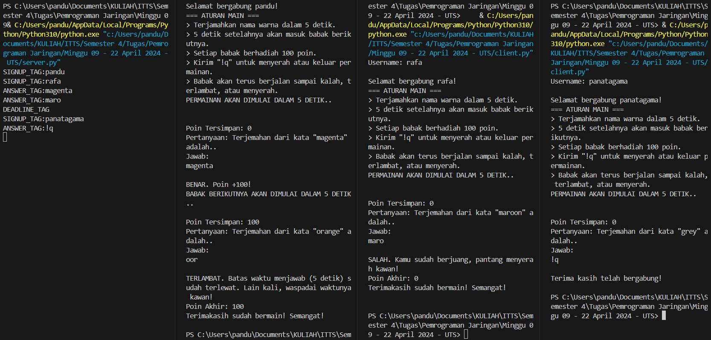
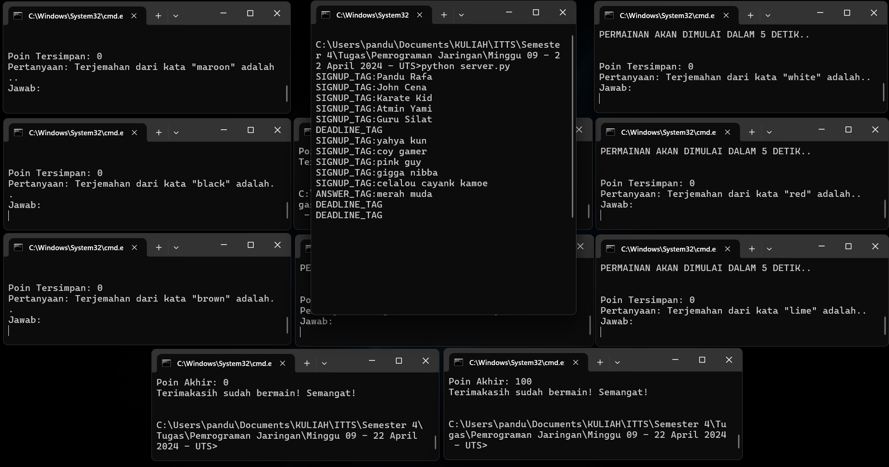

# UTS - Permainan One-to-Many Menggunakan Socket UDP

Permaianan ini melibatkan server dan satu atau lebih client. Permainan ini memiliki peraturan, aturan mainnya meilputi:
- Terjamahkan nama warna dalam 5 detik.
- 5 detik setelahnya akan masuk babak berikutnya.
- Setiap babak berhadiah 100 poin.
- Kirim "!q" untuk menyerah atau keluar permainan
- Babak akan terus berjalan sampai kalah, terlambat, atau menyerah.

<br>

## Server Dalam Memproses Permainan

Berikut adalah semua modul yang dimanfaatkan server dalam menjalankan permaianan ini.

```python
import socket
import threading
import queue
import random
import time
```

Awalnya server perlu menyiapkan socket UDP

```python
# Membuat socket UDP untuk client
server = socket.socket(socket.AF_INET, socket.SOCK_DGRAM)
server.bind(("localhost", 9999))
```

Nantinya setiap pesan yang masuk akan disimpan sementara dalam struktur data Queue messages dan data client meliputi (alamat, pertanyaan, jawaban, poin) akan disimpan dalam list clients.

```python
# Menyiapkan list dan struktur data queue
messages = queue.Queue()  # Menyimpan pesan masuk sementara
clients = []              # Menyimpan data client
```

Untuk bisa merima pesan dari client, digunakan fungsi khusus untuk menerima dan memasukkan tuple berisi pesan dan alamat ke dalam Queue messages.

```python
# Fungsi untuk menerima pesan para client
def receive():
  while True:
    try:
      message, addr = server.recvfrom(1024)
      messages.put((message, addr))
    except:
      pass
```

Semua data dalam queue diurus oleh fungsi handle. Fungsi ini menyiapkan data client yang belum disimpan server ke dalam list clients. Selain itu, fungsi ini mengurus pesan berdsarkan "siapa pengirimnya" dan memberikan respon yang sesuai kontek dari pesan yang diterima. 

> **TAG:** Dalam pertukaran pesan, tag dimanfaatkan untuk mengkategorikan pesan yang dikirim dan diterima. Ini membantu server maupun client mengenali konteks dari pesan dan memprosesnya sesuai konteks.

```python
# Fungsi untuk mengurus pesan-pesan yang masuk
def handle():
  while True:
    # Selama queue messages belum kosong
    while not messages.empty():
      message, addr = messages.get()
      print(message.decode())
      
      # Jika alamat yang diterima belum ada di client manapun dalam list clients
      if not any(client[0] == addr for client in clients):
        # Tambahkan data client meliputi
        # (address, question, answer, score)
        clients.append([addr, "", "", 0])
      
      # Iterasi setiap client
      for client in clients:
        try:
          # Jika pesan yang masuk dari client pada iterasi ini
          if client[0] == addr:
            
            # Client Masuk
            if message.decode().startswith("SIGNUP_TAG:"):
              name = message.decode()[message.decode().index(":")+1:]
              server.sendto(f"GREETING_TAG:\nSelamat bergabung {name}!\n=== ATURAN MAIN ===\n> Terjamahkan nama warna dalam 5 detik.\n> 5 detik setelahnya akan masuk babak berikutnya.\n> Setiap babak berhadiah 100 poin.\n> Kirim \"!q\" untuk menyerah atau keluar permainan.\n> Babak akan terus berjalan sampai kalah, terlambat, atau menyerah.\nPERMAINAN AKAN DIMULAI DALAM 5 DETIK..\n".encode(), client[0])
              generateQuestion(client)
            
            # Client Jawab
            elif message.decode().startswith("ANSWER_TAG:"):
              str = message.decode()[message.decode().index(":")+1:]
              # Jika client menyerah
              if str == "!q":
                server.sendto(f"SURREND_TAG:\nTerima kasih telah bergabung!\n".encode(), client[0])
              else:
                # Memeriksa jawaban biasa
                checkAnswer(client, str)
            # Client terlewat deadline
            elif message.decode() == "DEADLINE_TAG":
                server.sendto(f"FAILED_TAG:\nTERLAMBAT. Batas waktu menjawab (5 detik) sudah terlewat. Lain kali, waspadai waktunya kawan!\nPoin Akhir: {client[3]}\nTerimakasih sudah bermain! Semangat!\n".encode(), client[0])
            
            # Untuk Kemungkinan lain apabila terjadi kesalahan tag (untuk debugging)              
            # else:
            #   server.sendto(message, client[0])
              
        except:
          client.remove(message)
```

Berikut adalah daftar tag pesan yang direspon server.

| Tag Pesan | Konteks |
|----|----|
| SIGNUP_TAG | Client mengirim pesan pertamanya ke server, yang nantinya alamat client akan disimpan server. Server akan meresponnya dengan mengirim GREETING berupa sambutan, aturan main, dan peringatan siaga. |
| ANSWER_TAG | Pesan dari client berupa jawaban dari permainan warna. Server akan mengidentifikasi jenis ANSWER yang diterima sebelum diproses lebih lanjut. |
| DEADLINE_TAG | Ketika client terlambat mengirimkan jawaban dari permainan warna, maka client akan mengirim DEADLINE_TAG ke server. Server akan merespon tag ini dengan mengirimkan pesan berupa pmeberitahuan terlambat dan skor akhir client. |

Dan berikut adalah daftar tag pesan yang dikirim server ke client.

| Tag Pesan | Konteks |
|----|----|
| GREETING_TAG | Pesan dari server berupa pemberitahuan yang tidak perlu dibalas client. Client hanya akan menampilkannya. |
| SURREND_TAG | Ketika client mengirimkan ANSWER berupa kode "!q", maka server mengirimkan pesan penutup yang tidak perlu di balas client. Client yang meneriama pesan ini akan mengakhiri koneksi dan programnya. |
| FAILED_TAG | Jika pesan ANSWER dari client merupakan jawaban yang salah, maka server akan mengirimkan pesan pemberitahuan salah ke client. Client hanya menampilkan pesannya tanpa memberi balasan ke client.  |

Fungsi receive dan handle dijalankan menggunakan thread tersendiri agar tidak saling tunggu dalam memproses permainan.

```python
# Buat thread untuk menjalankan receive dan handle
t1 = threading.Thread(target=receive)
t2 = threading.Thread(target=handle)

# Jalankan thread yang sudah dibuat
t1.start()
t2.start()
```

Ketika client sudah masuk dan diberikan sambutan di awal, server akan mengirimkan pertanyaan ke server. Pertanyaan disiapkan dan dikirim melalui fingsi generateQuestion berikut ini.

```python
# Fungsi untuk menyiapkan pertanyaan dan mengirimnya ke client
def generateQuestion(clientData):
  # isi clientData = [addr, question, answer, score]
  question, answer = randColor()
  clientData[1] = question
  clientData[2] = answer
  # Mengirim pertanyaan ke client setelah 5 detik
  time.sleep(5)
  server.sendto(f"QUESTION_TAG:\nPoin Tersimpan: {clientData[3]}\nPertanyaan: Terjemahan dari kata \"{question}\" adalah..\nJawab: ".encode(), clientData[0])
```

Untuk mendapatkan warna acak yang berbeda dari client lainnya, maka diguankan fungsi randColor untuk mendapatkan warna dalam bahasa inggris sebagai pertanyaan dan terjemahannya sebagai kunci jawaban.

```python
# Fungsi untuk mendapatkan warna dalam inggris dan indonesia
def randColor():
  # 20 warna (question, answer)
  palette = [
    ("red", "merah"),
    ("blue", "biru"),
    ("green", "hijau"),
    ("yellow", "kuning"),
    ("black", "hitam"),
    ("white", "putih"),
    ("purple", "ungu"),
    ("orange", "oranye"),
    ("grey", "abu-abu"),
    ("pink", "merah muda"),
    ("brown", "coklat"),
    ("cyan", "biru muda"),
    ("magenta", "magenta"),
    ("lime", "hijau muda"),
    ("maroon", "merah tua"),
    ("navy", "biru tua"),
    ("olive", "zaitun"),
    ("teal", "biru hijau"),
    ("violet", "violet"),
    ("indigo", "nila"),
  ]
  while True:
    question, answer = random.choice(palette)
    # Jika warna tidak dimiliki client manapun dalam clients, maka kembalikan warna tersebut
    if not any(client[1] == question for client in clients):
      return (question, answer)
```

Jawaban yang masuk akan diarahkan fungsi handle agar diperiksa menggunakan dungsi checkAnswer. Tergantung benar-tidaknya jawaban, fungsi ini akan menambahkan nilai dan mengirimkan pesan GREETING atau hanya mengirimkan pesan FAILED.

```python
# Fungsi untuk memeriksa jawaban client
def checkAnswer(clientData, answer):
  if clientData[2] == answer:
    clientData[3] += 100
    server.sendto(f"GREETING_TAG:\nBENAR. Poin +100!\nBABAK BERIKUTNYA AKAN DIMULAI DALAM 5 DETIK..".encode(), clientData[0])
    generateQuestion(clientData)
  else:
    server.sendto(f"FAILED_TAG:\nSALAH. Kamu sudah berjuang, pantang menyerah kawan!\nPoin Akhir: {clientData[3]}\nTerimakasih sudah bermain! Semangat!\n".encode(), clientData[0])
    
```

Penjelasan di atas berurutan sesuai proses permainan, namun tidak urut sesuai kode program aslinya. Keseluruhan kode server dapat dilihat di dalam dokumen <a href="https://github.com/pandragama/pemrograman-jaringan/blob/main/Minggu%2009%20-%2022%20April%202024%20-%20UTS/server.py" target="_blank">server.py</a> yang tersedia dalam repositori ini.

<br>

## Client Dalam Memproses Permainan

Tanpa memanfaatkan struktur data Queue, modul yang digunakan client kurang lebih sama seperti server.

```python
import socket
import threading
import random
import time
```

Awalnya client akan membuat socket UDP dengan alamat yang sama dengan server (localhost), dan menggunakan port yang di generate secara random. Ini memungkinkan client dijalankan dibanyak instansi tanpa menggangu port satu sama lain. Dalam artian, banyak client sekaligus.

```python
# Membuat socket UDP untuk client dan menyambungkannya ke port random
client = socket.socket(socket.AF_INET, socket.SOCK_DGRAM)
client.bind(("localhost", random.randint(8000, 9000)))
```

Client memanfaatkan variabel-variabel berikut untuk mendukung berjalannya permainan. Variabel yang digunakan berupa list yang hanya berisi satu nilai. List yang pada dasarnya mirip pointer digunakan agar nilai variabel dapat diakses dan diubah dari dalam fungsi yang berjalan di thread yang berbeda.

```python
# List untuk menyimpan variabel pendukung permainan
status = [False]
answerSession = [False]
deadline = [False]
counter = [0]
```

Permainan diawali dengan client yang memasukkan username.

```python
# Awali dengan masukkan username agar alamat bisa disimpan server
name = input("Username: ")
```

Setelah itu username dikirimkan dalam pesan ber-tag SIGNUP ke alamat server. Nantinya, dari pesan pertama ini, server akan mendapatkan alamat client dan menyimpannya. Kemudian server akan mengirimkan pesan berupa sambutan, aturan main, dan peringatan siaga (permainan dimulai). Dalam lima detik kedepan, pertanyaan dari server akan dikirim ke client.

```python
# mengirim username dengan tag signup
client.sendto(f"SIGNUP_TAG:{name}".encode(), ("localhost", 9999))
```

Saat permainan dimulai, pesan masuk akan diurus fungsi game. Fungsi ini akan menerima pesan dari server dan mengarahkannya untuk diproses sesuai tag atau konteks pesannya.

```python
# Fungsi untuk menghandle permainan
def game():
  # Looping selama selama permainan belumm selesai
  while not status[0]:
    try:
      message, _ = client.recvfrom(1024)
      
      # Salam dari server
      if message.decode().startswith("GREETING_TAG:"):
        str = message.decode()[message.decode().index(":")+1:]
        print(str)
        
      # Client menyerah/keluar
      elif message.decode().startswith("SURREND_TAG:"):
        str = message.decode()[message.decode().index(":")+1:]
        print(str)
        # Permainan selesai = TRUE
        status[0] = True
      
      # Client menyerah/keluar
      elif message.decode().startswith("FAILED_TAG:"):
        str = message.decode()[message.decode().index(":")+1:]
        print(str)
        # Permainan selesai = TRUE
        status[0] = True
      
      # Pertanyaan dari server
      elif message.decode().startswith("QUESTION_TAG:"):
        str = message.decode()[message.decode().index(":")+1:]
        print(str)
        
        # Sesi menjawab 5 detik
        answerSession[0] = True
        answer = input("")
        answerSession[0] = False
        counter[0] = 0
        
        # Jika belum 5 detik, maka kirim jawaban
        if deadline[0] == False:
          client.sendto(f"ANSWER_TAG:{answer}".encode(), ("localhost", 9999))
        # Jika deadline, kirim tag deadline
        else:
          client.sendto("DEADLINE_TAG".encode(), ("localhost", 9999))
        
    except:
      pass
```

Berikut adalah daftar tag pesan yang direspon client.

| Tag Pesan | Konteks |
|----|----|
| GREETING_TAG | Pesan dari server berupa pemberitahuan yang tidak perlu dibalas client. Client hanya akan menampilkannya. |
| SURREND_TAG | Ketika client mengirimkan ANSWER berupa kode "!q", maka server mengirimkan pesan penutup yang tidak perlu di balas client. Client yang meneriama pesan ini akan mengakhiri koneksi dan programnya. |
| FAILED_TAG | Jika pesan ANSWER dari client merupakan jawaban yang salah, maka server akan mengirimkan pesan pemberitahuan salah ke client. Client hanya menampilkan pesannya tanpa memberi balasan ke client.  |

Dan berikut adalah daftar tag pesan yang dikirim client ke server.

| Tag Pesan | Konteks |
|----|----|
| SIGNUP_TAG | Client mengirim pesan pertamanya ke server, yang nantinya alamat client akan disimpan server. Server akan meresponnya dengan mengirim GREETING berupa sambutan, aturan main, dan peringatan siaga. |
| ANSWER_TAG | Pesan dari client berupa jawaban dari permainan warna. Server akan mengidentifikasi jenis ANSWER yang diterima sebelum diproses lebih lanjut. |
| DEADLINE_TAG | Ketika client terlambat mengirimkan jawaban dari permainan warna, maka client akan mengirim DEADLINE_TAG ke server. Server akan merespon tag ini dengan mengirimkan pesan berupa pmeberitahuan terlambat dan skor akhir client. |

Fungsi game dijalankan menggunakan thread tersendiri agar tidak perlu menunggu proses threadd utama.

```python
# Buat dan jalankan thread daemon untuk menjalankan fungsi game di balik layar
t = threading.Thread(target=game, daemon=True)
t.start()
```

Thread utama mengerjakan perulangan tak terbatas yang akan siap mendeteksi status permainan. Jika nilai status[0] adalah true artinya pemain atau client sudah memasuki kondisi selesai. Kondisi selesai dipicu ketika client salah menterjemahkan warna, terlambat mengirim jawaban, atau menyerah.

```python
# Looping di thread utama
while True:
  # Jika permainan selesai adalah true, maka tutup koneksi dan akhiri program
  if status[0] == True:
    client.close()
    exit()
  
  # Jika sedang dalam sesi menjawab, hitung sesi selama 5 detik
  if answerSession[0] == True:
    time.sleep(1)
    counter[0] += 1
    # Jika sudah lebih dari 5 detik, maka deadline bernilai true
    if counter[0] >= 5:
      deadline[0] = True
```

Penjelasan di atas berurutan sesuai proses permainan, namun tidak urut sesuai kode program aslinya. Keseluruhan kode client dapat dilihat di dalam dokumen <a href="https://github.com/pandragama/pemrograman-jaringan/blob/main/Minggu%2009%20-%2022%20April%202024%20-%20UTS/client.py" target="_blank">client.py</a> yang tersedia dalam repositori ini.

<br>

## Preview

Berikut adalah bagaimana tiga client dalam tiga kondisi "keluar permainan" yang berbeda. 

<br>



<br>

Bagian paling kiri adalah server. Di sebelah kanan, pertama ada client yang terlambat mengirim jawaban. Kedua, ada client yang salah menjawab pertanyaan. Dan yang paling kanan, atau ketiga ada client yang menyerah dengan mengirimkan pesan "!q". 

<br>



<br>

Gambar di atas adalah kondisi bagaimana jadinya bila terdapat sepuluh client yang terhubung dengan server dan setiap client memainkan permainannya.
